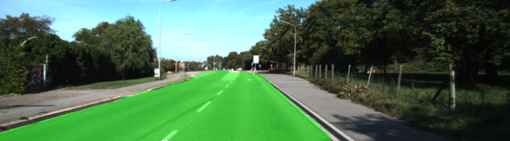

# Semantic Segmentation
### Introduction
In this project, you'll label the pixels of a road in images using a Fully Convolutional Network (FCN).

### Neural Network Architecture
Fully Convolutional Network for Semantic Segmentation [FCN-8](https://people.eecs.berkeley.edu/~jonlong/long_shelhamer_fcn.pdf) was used in order to approach the project.
Network architecture consists of two main parts: encoder and decoder with softmax classifier.

#### Encoder
The encoder for FCN-8 is the VGG16 model pretrained on ImageNet for classification. The fully-connected layers are replaced by 1-by-1 convolutions.

#### Decoder
Decoder part consists of 3 upsample layers:
```
output = tf.layers.conv2d_transpose(input, num_classes, 4, strides=(2, 2))
```
connected with skip connections with more detailed layers:
```
input = tf.add(input, pool_4)
```
to produce accurate and detailed segmentations.

#### Training
Cross entropy loss function is used to calculate error between predicted and ground truth labels:
```
cross_entropy_loss = tf.reduce_mean(tf.nn.softmax_cross_entropy_with_logits(logits=logits, labels=correct_label))
```
Also, reqularization loss is used to improve generalization and reduce overfitting:
```
reg_losses = tf.get_collection(tf.GraphKeys.REGULARIZATION_LOSSES)
cross_entropy_loss = cross_entropy_loss + 0.001 * tf.reduce_sum(reg_losses)
```
I took lambda=0.001 and did not try to tune it.
Adam optimizer was used, since it does not require learning rate turning:
```
adam_optimizer = tf.train.AdamOptimizer(learning_rate=learning_rate).minimize(cross_entropy_loss)
```

#### Hyperparameters
The following hyperparameters were finally used:
* `keep_prob: 0.5` I did not try to change this parameter.
* `learning_rate: 0.0005` I tried to use values: 0.01, 0.001, 0.0005, 0.00025 and it turned out that `0.0005` showed the best result.
* hyperparameter  `λ: 0.001`
* `batch_size: 16` It turned out that there was not enough space on GPU in order to use `batch_size=32`
* `epochs: 20` It is just default value, it can be increased easily and also, I could start training from any checkpoint from previous runs.

### Results
The model was trained and tested using [Kitti Road dataset](http://www.cvlibs.net/datasets/kitti/eval_road.php).
Data augmentation was not used.
Here are some results showing overal performance:





Also, model was run on sample [video](data/driving.mp4).
Result is available [here](runs/result.mp4).
Performance is not good enough.
In order to improve performance more data and augmented data should be used for training.
Also, may be further hyperparameter turning will also improve quality.

### Setup
##### Frameworks and Packages
Make sure you have the following is installed:
 - [Python 3](https://www.python.org/)
 - [TensorFlow](https://www.tensorflow.org/)
 - [NumPy](http://www.numpy.org/)
 - [SciPy](https://www.scipy.org/)
##### Dataset
Download the [Kitti Road dataset](http://www.cvlibs.net/datasets/kitti/eval_road.php) from [here](http://www.cvlibs.net/download.php?file=data_road.zip).  Extract the dataset in the `data` folder.  This will create the folder `data_road` with all the training a test images.

### Start
##### Implement
Implement the code in the `main.py` module indicated by the "TODO" comments.
The comments indicated with "OPTIONAL" tag are not required to complete.
##### Run
Run the following command to run the project:
```
python main.py
```
**Note** If running this in Jupyter Notebook system messages, such as those regarding test status, may appear in the terminal rather than the notebook.

### Submission
1. Ensure you've passed all the unit tests.
2. Ensure you pass all points on [the rubric](https://review.udacity.com/#!/rubrics/989/view).
3. Submit the following in a zip file.
 - `helper.py`
 - `main.py`
 - `project_tests.py`
 - Newest inference images from `runs` folder  (**all images from the most recent run**)
 
 ### Tips
- The link for the frozen `VGG16` model is hardcoded into `helper.py`.  The model can be found [here](https://s3-us-west-1.amazonaws.com/udacity-selfdrivingcar/vgg.zip)
- The model is not vanilla `VGG16`, but a fully convolutional version, which already contains the 1x1 convolutions to replace the fully connected layers. Please see this [forum post](https://discussions.udacity.com/t/here-is-some-advice-and-clarifications-about-the-semantic-segmentation-project/403100/8?u=subodh.malgonde) for more information.  A summary of additional points, follow. 
- The original FCN-8s was trained in stages. The authors later uploaded a version that was trained all at once to their GitHub repo.  The version in the GitHub repo has one important difference: The outputs of pooling layers 3 and 4 are scaled before they are fed into the 1x1 convolutions.  As a result, some students have found that the model learns much better with the scaling layers included. The model may not converge substantially faster, but may reach a higher IoU and accuracy. 
- When adding l2-regularization, setting a regularizer in the arguments of the `tf.layers` is not enough. Regularization loss terms must be manually added to your loss function. otherwise regularization is not implemented.
 
### Using GitHub and Creating Effective READMEs
If you are unfamiliar with GitHub , Udacity has a brief [GitHub tutorial](http://blog.udacity.com/2015/06/a-beginners-git-github-tutorial.html) to get you started. Udacity also provides a more detailed free [course on git and GitHub](https://www.udacity.com/course/how-to-use-git-and-github--ud775).

To learn about REAMDE files and Markdown, Udacity provides a free [course on READMEs](https://www.udacity.com/courses/ud777), as well. 

GitHub also provides a [tutorial](https://guides.github.com/features/mastering-markdown/) about creating Markdown files.
